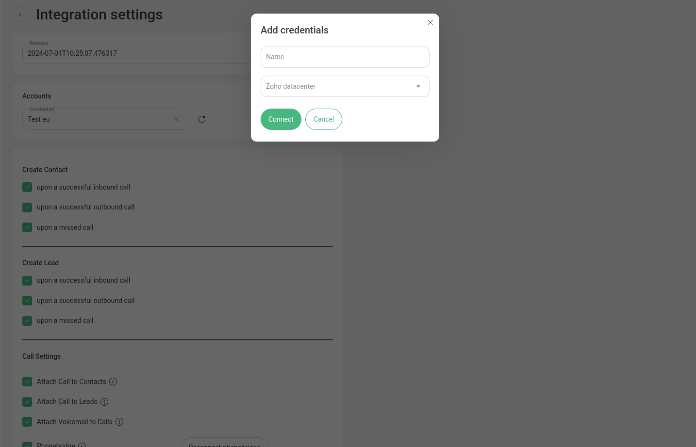
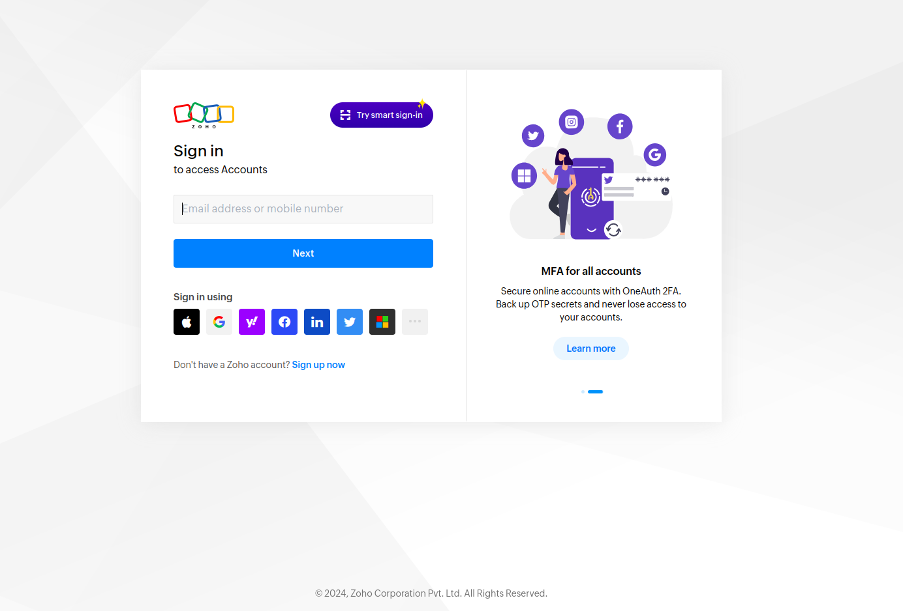
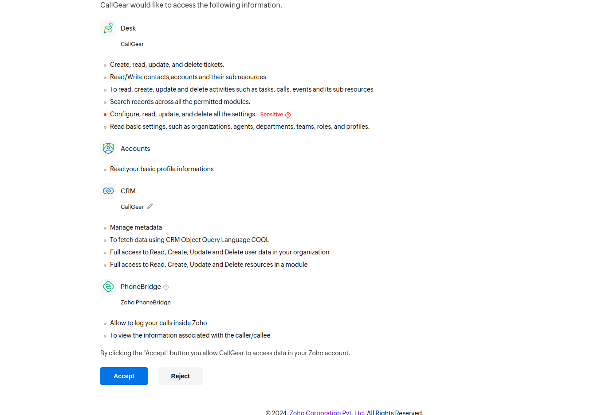
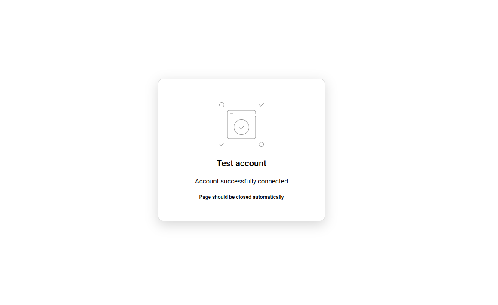
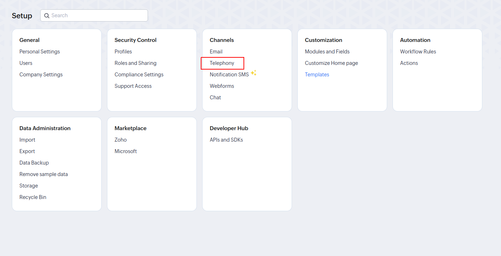
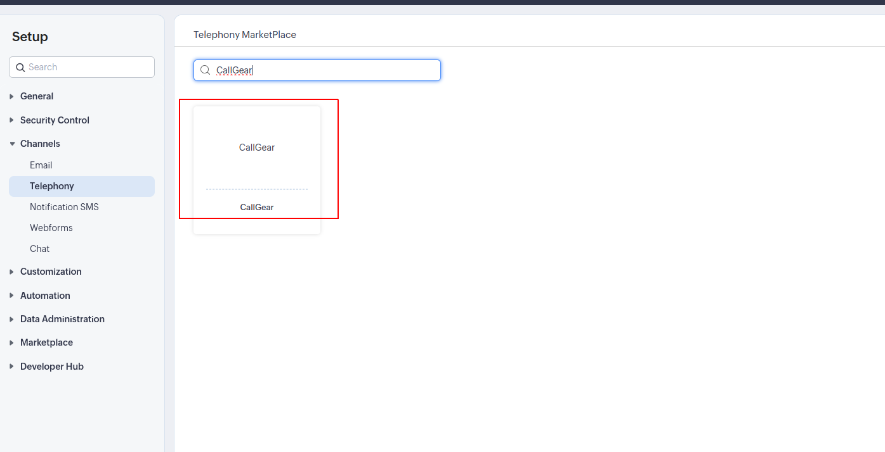
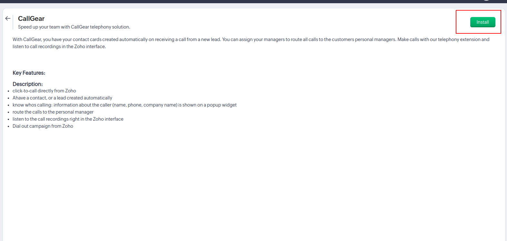
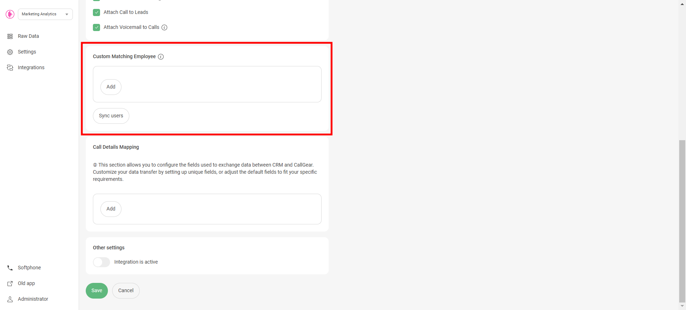
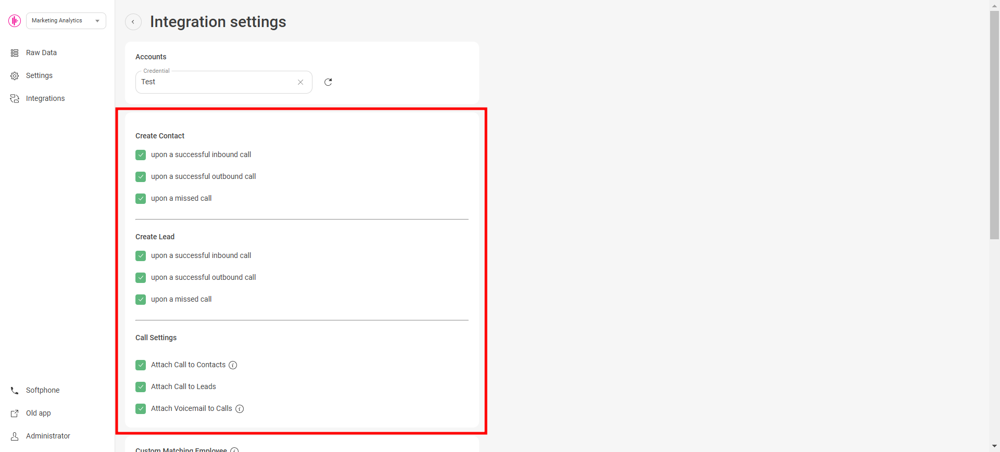
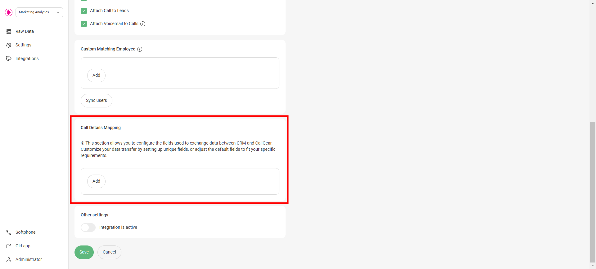

# Zoho CRM Integration

These instructions are for users who wish to set up an integration between CallGear and Zoho CRM. Below is the functionality as well as the steps to set up the integration.

## Available Features

Click to expand/collapse

- **Automated Contact and Lead Creation**: Automatically create contacts or leads after successful inbound, outbound, or missed calls.
- **Automated Call Routing**: Route calls to the appropriate manager (contact or lead owner) in Zoho CRM, ensuring efficient communication management.
- **Flexible Call Attachment Options**: Customize call attachments by linking call recordings/voicemail and related information to related contacts or leads.
- **Customized Data Transfer**: Customize how data transfers from CallGear to specific Zoho CRM fields to improve data integrity.
- **Click-to-Call Widget**: Initiate inbound and outbound calls directly within your CRM system with a convenient Softphone widget, enabling quick and efficient communication with customers and prospects.
- **Phonebridge calls**: Initiate outbound calls directly within your CRM system with a Zoho phonebridge.

## Integration Setup

Initial Setup Steps & CallGear Softphone Widget

### Initial Steps

1. **Account Login**:
    - Go to the CallGear platform and log in to your account.
2. **Turn on integration**:
   - Go to the Integration section (left sidebar).
   - Click on Zoho CRM in the list of integrations and proceed to its configuration.

3. **Authorization**:
    - Add Zoho CRM Credentials Name.
    - Select your specific Zoho Datacenter.
    - Save and confirm the connection.
      
    - Sign in yor Zoho account
   
    - Accept access
   
    - Account connected.
   
### CallGear Softphone Widget

1. **Installation**:
    - Use the [provided link](https://chromewebstore.google.com/detail/callgear/gmepbeelpjhhlnkccmclgijnnleadijl) to download and install the widget.
2. **Authorization**:
    - Authenticate using your CallGear account credentials.
    - Log in to the installed widget under the same account.
3. **Functionality Check**:
    - Enable the "Show softphone" option within Zoho CRM.
    - Make sure that the widget icon is displayed.

### Phonebridge installation

1. **Installation**:
    - In Zoho CRM settings select Telephony.
      
    - Chouse CallGear PBX.
    
    - Install CallGear PBX and select users
       
2. **Integration setting**:
    - Turn on phonebridge setting.
   

Integration Settings (Calls)

### Matching Employee

- Configure a custom match between CallGear and Zoho CRM users to automatically route calls to the responsible manager (contact or lead owner).
   
_If the system identifies a Zoho CRM customer on an incoming call, the call is automatically forwarded to their Contact Owner (personal manager)._

### Data Transfer Setup

- **Call Transfer Control**:
  - Enable or disable the creation of tickets or deals according to your needs.
  - Configure leads and contacts creation settings, including pipeline and stage.
     
- **Attaching Call Recordings**:
  - Define sources from which you want to receive recordings and call information.
  - Enable feature to automatically attach voicemail recordings to appropriate contacts if voicemail is configured.
- **Call Details Mapping**:
  - Configure the transfer of call information from CallGear to Zoho CRM:
    - Choose an object type: Contacts and Leads.
    - Select the information you want to transfer from CallGear.
    - Select the field in the Zoho CRM object to which this information will be transferred.
     

Integration Settings (Chats)
  

- Most settings for creating entities in chats are similar to calls, with a few key differences:
  

  - Entities are created once per chat session, triggered by either a client or employee first message, regardless of the number of messages exchanged before the chat closes.
    
  - When a client sends the first message, no employee is assigned yet, so an owner can’t be set. The owner is assigned automatically by Zoho, and can be updated after an employee replies, if enabled in the integration. 
    
  - If the client’s phone number is hidden, entity names will contain information about this.
  

## Support

If you encounter any issues or have further questions, please reach out to [CallGear Support](mailto:support@callgear.com) for assistance.
